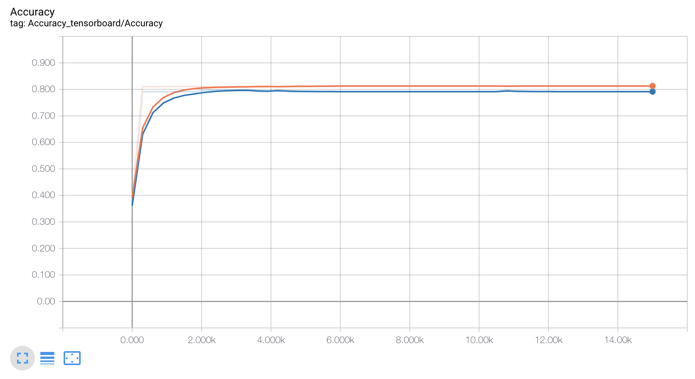
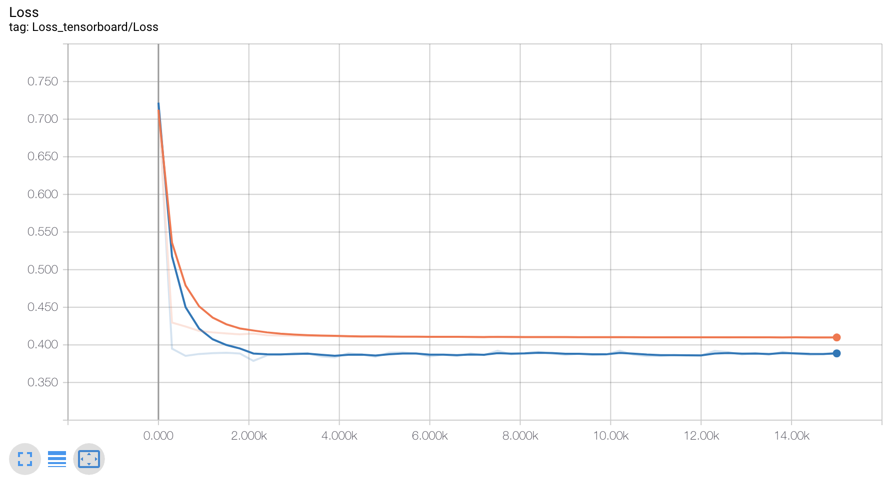

# Machine Learning Titanic Survival Prediction
This repository includes a really simple machine learning algorithm for digit recognition based in the famous MNIST dataset. 

### Data
Dataset downloadable from [kaggle competition](https://www.kaggle.com/c/titanic/data).

### Approach
My approach to solving this challenge was to use a Deep neural network with 4 hidden layers

#### Graph
- Input of 10 features
- Hidden layer No. 1| 256 nodes | Activation function = ReLU
- Hidden layer No. 2| 512 nodes | Activation function = ReLU
- Dropout Layer
- Hidden layer No. 3| 256 nodes | Activation function = ReLU
- Hidden layer No. 4| 64 nodes | Activation function = ReLU
- Dropout Layer
- Hidden layer No. 2| 2 nodes | (output layer)

### Training
In order to train the model, I used softmax cross-entropy as a loss function, taking the mean of it to optimize the model. The optimizer I chose is Adam optimizer with a learning rate of 0.0001. In order to train the model, I used an 4 CPUs instance in GCP, training for 15,000 steps. 

#### Accuracy graph

#### Loss Graph

### Results
After training the model for 15,000 steps I got **0.75119% of accuracy** on the test set provided by Kaggle.

### References
- https://www.tensorflow.org/guide/

### Dependencies
- tensorflow
- python
- numpy
- pandas
- matplotlib

### Authors
Juan Pedro Casian - Github: [@JuanCasian](https://github.com/JuanCasian) - Email: juanpedrocasian@gmail.com
